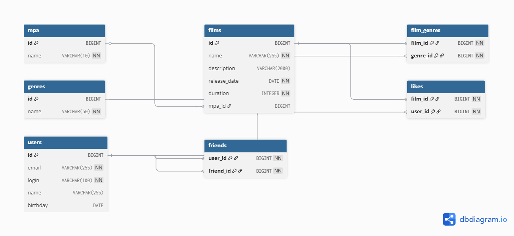

# Проектирование базы данных для Filmorate

## ER-диаграмма


## Описание схемы
База данных состоит из 7 таблиц, соответствующих требованиям технического задания:

1. **users** - информация о пользователях (email, login, name, birthday).
2. **films** - данные о фильмах (name, description, release_date, duration, mpa_id).
3. **mpa** - рейтинги MPA (например, G, PG, PG-13 и т.д.).
4. **genres** - жанры фильмов.
5. **friends** - связи дружбы между пользователями.
6. **film_genres** - связь фильмов с жанрами (многие-ко-многим).
7. **likes** - лайки пользователей для фильмов (многие-ко-многим).

Схема соответствует третьей нормальной форме (3НФ):
- Все атрибуты атомарны.
- Отсутствуют частичные зависимости.
- Отсутствуют транзитивные зависимости.

## Основные бизнес-сценарии
1. **Дружба**:
   - Пользователь A добавляет пользователя B в друзья (запись в таблице `friends`).
   - Поддерживается двунаправленная связь (A → B и B → A).
2. **Множественные жанры**: Один фильм может относиться к нескольким жанрам через таблицу `film_genres`.
3. **Рейтинги MPA**: Каждый фильм связан с одним рейтингом MPA через `mpa_id` в таблице `films`.
4. **Лайки**: Пользователи могут ставить лайки фильмам, что фиксируется в таблице `likes`.

## Примеры запросов
Полные примеры SQL-запросов для основных операций доступны в [example_queries.sql](src/main/resources/example_queries.sql).

### Ключевые запросы:
```sql
-- Топ-5 популярных фильмов
SELECT f.id, f.name, COUNT(l.user_id) AS likes
FROM films f
LEFT JOIN likes l ON f.id = l.film_id
GROUP BY f.id, f.name
ORDER BY likes DESC
LIMIT 5;

-- Друзья пользователя
SELECT u.login, u.name
FROM friends f
JOIN users u ON f.friend_id = u.id
WHERE f.user_id = 1;

-- Фильмы с рейтингом PG-13
SELECT f.name, m.name AS mpa
FROM films f
JOIN mpa m ON f.mpa_id = m.id
WHERE m.name = 'PG-13';